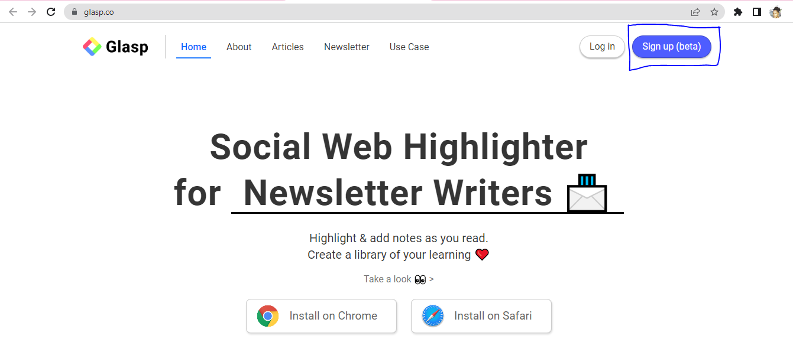
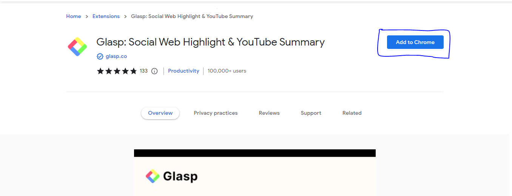
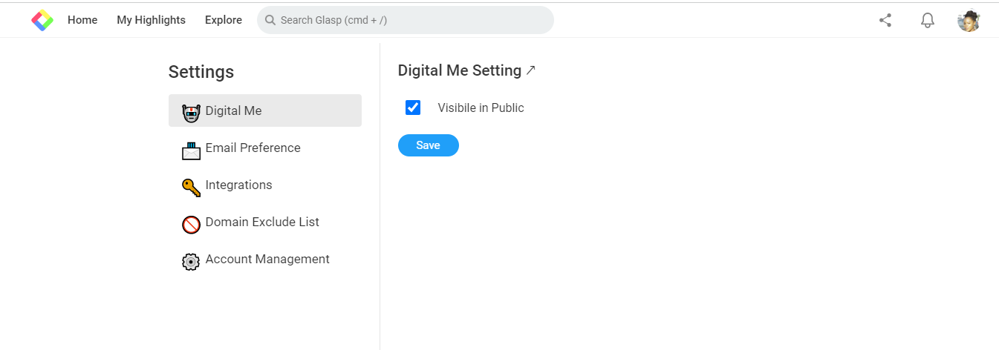

# Glasp - A Walkthrough Guide
___

### **Table of Content**

- Overview
- Introduction
- What is Glasp
- Why Glasp
- Features 
- Installation
- How to use Glasp
- Conclusion
---

   
### 
**OVERVIEW**

One of the frustrating moments for learners is when working on a project or writing a thesis and you come across several information that are inspiring and educative, and you are trying to put them all together as a solid point for your work and then just to realise that you did not write down the page, chapter, or title of the article.

As far back as I could say the alphabet without stuttering and knowing how to read and write. One of my self-awareness moments is being an organized reader with an intuitive mind of capturing everything I glance on. For this reason, I wished my collections of books were highlighted digitally for future reference instead of relying on the traditional methods. 

With the implementation of Glasp - a socila higlighter, my wish was fulfilled. Today, I can comfortably read, and share my thoughts by highlighting my notes, research articles, books and connect with other learners globally. 

**INTRODUCTION**

People employed a number of conventional note-taking techniques before digital note-taking tools like Glasp. Pen and paper, typewriters, dictaphones, sticky notes, and mind maps were among this techniques.

Glasp allows users to highlight and share content with their social networks. The content may be in the form of articles, blog entries, videos, or other formats. Making it simple for users to discover and share what they may find interesting is the aim.

**WHAT IS GLASP**

Glasp stands for Greatest Legacy Accumulated as Shared Proof. Using Glasp, users can collect and highlight quotes and ideas from the web without switching between windows while simultaneously accessing the knowledge of other like-minded people.

Glasp is often referred to as the "social web highlighter."  It is a web highlighter that enables you to swiftly and effectively highlight crucial passages while reading. 

Glasp is a service that enables users save and share highlights and notes from various applications. It was created by Kazuki Nakayashiki in 2021.
The elimination of knowledge isolation is Glasp's main goal.

---

### **WHY GLASP**

With Glasp you may rapidly record internet material with colorful highlighting options with Glasp's free browser plugin, and the content is then automatically curated to appear on your homepage. 

Glasp promotes note-taking and engaged reading. It is a personalized summary based on your highlights and notes.

Glasp is an AI powered tool that allows collection of knowledge, insights, experiences to be captured and stored for a lifetime on the web, providing accessibility to your highlighted documents, articles, books, ideas, etcetera which can be shared on different platforms such as Twitter, Team and Slack. You can also share them with like-minded people and with your friends.  

Highlights and notes on Glasp are public which can be shared through and *link* which becomes accessible to others. 

**FEATURES**

1. Export highlight and note: Glasp provides three categories of exporting highlights and notes. These includes; 

- Copy and paste
- Through a file, either collectively or individually in several formats such as, CSV, HTML, Text, MD and picture (png).
- Through [Readwise](https://medium.com/glasp/tutorial-how-to-export-web-highlights-into-readwise-2311e85ccaca) via integrations with other apps and export as a file..

2. Desktop access: Glasp works only on desktop and is compatible with Chrome, Brave, Edge, or Safari as a browser extension. 

3. Glasp is free: There is no subcription required to use Glasp.
4. User friendly: Easy to highlight. The level of detail in the summary can be changed by the user, and they can select from a variety of languages and have important words highlighted.
5. Language support: Multiple languages, including English, French, German, Italian, Portuguese, and Spanish, are supported by Glasp. 

6. Supports Sharing: can be sent via email, social media, messaging applications, or copied to a text editor.

7. Productivity: In academic, professional, and personal situations, utilizing a note highlighter can save time and increase productivity.

**KINDLE NOTE APP AND GLASP**

Kindle is a line of e-readers that use e-ink technology to provide a paper-like reading experience, making it easier on the eyes for prolonged reading. Users are able to download, read, and buy digital books, newspapers, magazines, and other material from Amazon's online shop is provided to users.

Glasp collect information using Kindle. You can organize your highlights in Glasp by importing your Kindle highlights and notes.

**INSTALLATION**
1. On your desktop, go to your browser (Chrome, Brave, Edge, or Safari), visit [glasp.co](https://glasp.co/)

2. Create a Google account by clicking [Sign up](https://glasp.co/secret-signup) (beta).

3. Install Chrome, Edge, Brave, or Safari extension on your desktop. 

4. Click the "Add to Chrome" link in the top-right corner of the page. When adding the extension, a confirmation pop-up window will ask for your approval.

4. Once the installation is completed, you will see the Welcome page.
Go to the homepage by clicking on the Glasp icon on the sidebar. 
On the Home page, you can have access to varieties of topic, choose your favorite topic.

**HOW TO USE GLASP**

After the completion of the installation process. You can start using Glasp-on-the-go.
In Glasp, there are two pages. 

1. Profile page collects all of your highlighted articles, highlights, and notes.
2. Explore page allows you to access relevant content, interact with other learners who have highlighted the same item as you, and learn about new topics.
- On a page, choose the text you want to highlight. Select any color you like from the popup that appears and a highlight will be applied to the text. The highlighted sentence is displayed on the sidebar.

- By clicking the "copy content" or "Share" buttons, you can download or export content.
- Add tags or leave comments on your saved content.

**SETTINGS**

You can customize Glasp based on your preference by clicking on settings when you select your profile page on the right hand corner. 

**CONCLUSION**

The majority of social highlighting systems will have tools that let users make profiles, follow other users, and group their highlights into collections or categories. For users to track the effectiveness of their highlights, some platforms may also include services like commenting, messaging, and statistics.